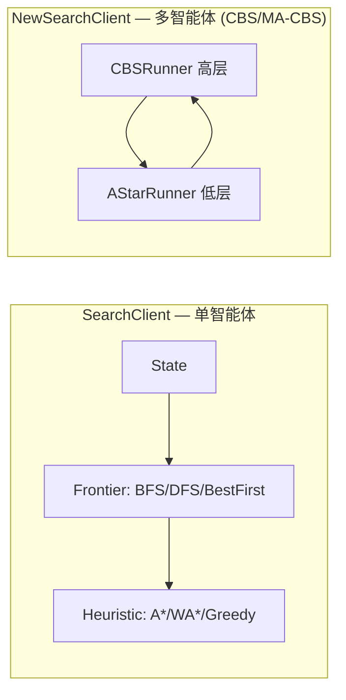
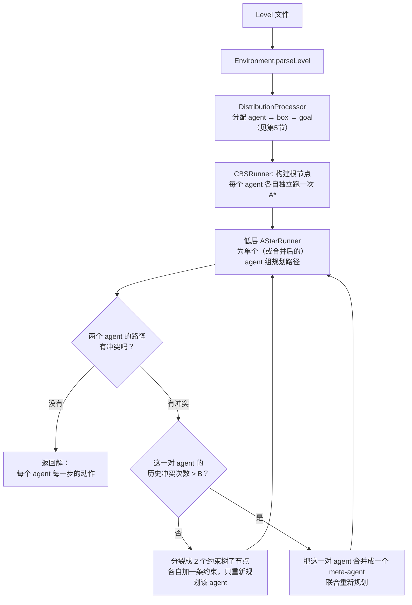
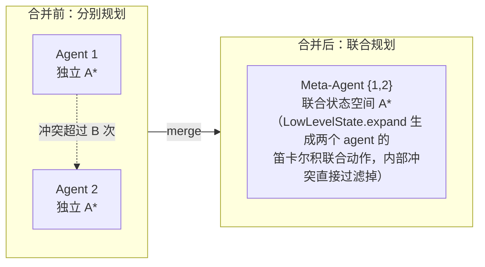

<!-- markdownlint-disable -->
# 算法详解：多智能体推箱子寻路系统

这篇文档配合 [README.md](README.md) 使用,面向想搞清楚"这个项目到底在算什么"的人,重点拆解 **A\*** 和 **MA-CBS (Meta-Agent Conflict-Based Search)** 这两个核心算法,并逐一对照仓库里的真实代码(不是教科书伪代码)。

## 目录

1. [项目要解决的问题](#1-项目要解决的问题)
2. [整体架构:两条搜索链路](#2-整体架构两条搜索链路)
3. [A\* 算法详解](#3-a-算法详解)
4. [MA-CBS 算法详解](#4-ma-cbs-算法详解)
5. [任务分配:CBS 之前的预处理](#5-任务分配cbs-之前的预处理)
6. [关键类速查表](#6-关键类速查表)
7. [已知局限](#7-已知局限)
8. [参考资料](#8-参考资料)

---

## 1. 项目要解决的问题

关卡是一张网格地图:墙、若干个**带颜色的 agent**、若干个**带颜色的 box**、若干个**goal 格子**。

- agent 只能 `Move`/`Push`/`Pull` 和自己同色的 box(或 `NoOp`)。
- 每个 goal 要求特定字母的 box,或特定编号的 agent,停在上面。
- 一个字母的 box 可能有好几个,一种颜色的 agent 也可能有好几个 —— 所以在真正"搜路"之前,还得先决定"谁负责搬哪个箱子去哪个目标"(见第 5 节)。
- 最终要为**每一个时间步、每一个 agent** 给出一个合法动作,使得所有 agent/box 都不会撞在一起。

这本质上是两个叠在一起的难题:

- **单智能体搜索问题**:给一个 agent(可能还拖着 box),怎么最快走到目标? → 用 **A\***。
- **多智能体协同问题**:N 个各自最优的路径放在一起大概率会撞车,怎么在不牺牲太多最优性的前提下把冲突消掉? → 用 **CBS / MA-CBS**。

## 2. 整体架构:两条搜索链路

仓库里其实有两个独立的客户端,分别对应上面两个难题的"教学版"和"进阶版":



- `searchclient/GraphSearch.java` + `Frontier.java` + `Heuristic.java` 是**单智能体**版本,教科书式地实现了 BFS/DFS/A\*/WA\*/Greedy,入口是 `SearchClient.java`。
- `searchclient/cbs/**` 是**多智能体**版本,入口是 `NewSearchClient.java`,内部的"低层"仍然是 A\*(`AStarRunner`),但外面包了一层"高层" `CBSRunner` 负责协调多个 agent。

也就是说,**MA-CBS 的低层求解器本身就是一个 A\* 实现**,理解了第 3 节的 A\*,才能看懂第 4 节 MA-CBS 里"低层重新规划"到底在算什么。

## 3. A\* 算法详解

### 3.1 核心公式

A\* 用一个评估函数给每个待扩展的状态打分:

```
f(n) = g(n) + h(n)
```

- `g(n)`:从起点走到状态 `n` 已经花费的真实代价(这里就是步数)。
- `h(n)`:从 `n` 到目标的**估计**代价(启发函数,不知道真实值,只能猜)。
- 每次从 frontier(优先队列)里弹出 `f` 最小的状态展开,直到弹出的状态就是目标。

只要 `h` 是 **admissible**(从不高估真实代价),A\* 保证第一次把目标状态弹出队列时,找到的就是最优解 —— 这是它比 Greedy(只看 `h`,不保真实代价)更"讲道理"、又比 BFS/Dijkstra(只看 `g`,不看方向)更快的原因。

### 3.2 项目里的通用搜索骨架

`searchclient/GraphSearch.java` 实现的就是 AIMA 教材图 3.7 的 Graph-Search:

```java
frontier.add(initialState);
HashSet<State> expanded = new HashSet<>();
while (true) {
    if (frontier.size() == 0) return null;          // 无解
    State current = frontier.pop();
    if (current.isGoalState()) return current.extractPlan();
    expanded.add(current);
    for (State child : current.getExpandedStates()) {
        if (!expanded.contains(child) && !frontier.contains(child)) {
            frontier.add(child);
        }
    }
}
```

这段代码本身跟"用什么策略"无关 —— 决定它是 BFS、DFS 还是 A\* 的,是传进来的 `Frontier` 实现([Frontier.java](searchclient/Frontier.java)):

| Frontier 实现 | 数据结构 | 排序依据 |
|---|---|---|
| `FrontierBFS` | 队列(FIFO) | 先进先出 |
| `FrontierDFS` | 栈(LIFO) | 后进先出 |
| `FrontierBestFirst` | 优先队列 | 按 `Heuristic.f(state)` |

`FrontierBestFirst` 配上不同的 `Heuristic` 子类就变成了三种不同算法([Heuristic.java](searchclient/Heuristic.java)):

```java
class HeuristicAStar extends Heuristic {
    public int f(State s) { return s.g() + this.h(s); }        // 标准 A*
}
class HeuristicWeightedAStar extends Heuristic {
    public int f(State s) { return s.g() + this.w * this.h(s); } // 加权 A*，w>1 更激进
}
class HeuristicGreedy extends Heuristic {
    public int f(State s) { return h(s); }                       // 纯贪心，完全不看 g
}
```

命令行 `-astar`/`-wastar`/`-greedy` 只是选择用哪个 `Heuristic` 子类,`GraphSearch` 代码完全不用改 —— 这是策略模式(Strategy Pattern)的典型应用。

### 3.3 启发函数:h(n) 怎么估

光有框架不够,`h(n)` 猜得准不准直接决定 A\* 快不快。项目里有两版(`HeuristicsForSimple.java` / `HeuristicsForFull.java`):

**① 曼哈顿距离之和(`HeuristicsForSimple.hDistance`)**

对每个还没到位的 agent/box,算它到目标的曼哈顿距离,全部加起来。这是多智能体寻路里最常见的 admissible 启发式 —— 因为真实代价至少要走完这么多格子(忽略了墙和碰撞,所以是下界,不会高估)。

**② 按颜色分组取最大值(`HeuristicsForFull.hDistance`)**

```
1. 把 agent 和 box 按颜色分组（同色的才可能互相帮忙）
2. 每组内部单独估算这组要花多少步
3. 总的 h = max(各组的估算值)，而不是 sum
```

这里的直觉是:不同颜色的组是**相互独立、可以并行推进**的任务,谁最慢,整体就至少要那么久 —— 用 `max` 比用 `sum` 更贴近真实的多智能体并行特性,heuristic 更紧(更接近真实值),搜索时展开的节点更少。命令行用 `-newdistance` 启用这一版。

> 这是本项目对课程给的两个"练习级"启发式(`hGoal` 数错位目标个数 / `hDistance` 曼哈顿距离)的改进,思路来自"把互不相关的子问题拆开算、取瓶颈"这一经典 pattern-database 式启发式设计手法。

### 3.4 MA-CBS 低层的 A\*:和"标准 A\*"不完全一样

`CBSRunner`(高层)每次要给某个 agent 重新规划路径时,调用的是 `AStarRunner.findPath`([AStarRunner.java](searchclient/cbs/algriothem/AStarRunner.java)),骨架和第 3.2 节一模一样(弹出 → 判目标 → 展开 → 塞回队列),但排序用的评估函数在 [LowLevelState.java:465](searchclient/cbs/model/LowLevelState.java#L465) 里是:

```java
private double getWeightedAStar() {
    return 2 * this.getHeuristic() + 0.5 * this.timeNow;   // f = 2h + 0.5g
}
```

这其实是**加权 A\***(`h` 的权重是 `g` 的 4 倍),不是教科书里 `f=g+h` 的纯 A\*。好处是搜索更"贪",在这种带约束的重复规划场景下更快出解;代价是**理论上不再保证低层路径本身最短**(不过 CBS 高层本来就是逐层加约束再重新搜,对绝对最优性的追求让位于"能不能按时算出解")。

`getHeuristic()` 用的是 `env.getCostMap()` 里预先算好的**真实可达最短路(不是曼哈顿距离)**,即先用一次 A\* 可达性分析(`AStarReachabilityChecker`)把整张地图的最短路缓存下来,查表 O(1) 拿到,这样每次低层搜索的 `h` 既快又准(等价于真实无障碍最短路,比曼哈顿距离更紧)。

`AStarRunner` 还额外支持一个可选的 **EPEA\*(Enhanced Partial Expansion A\*)** 优化(`doEPEA`,靠 `-EPEA` 参数开启):普通 A\* 展开一个节点会把它所有子节点都塞进 frontier,EPEA\* 只塞 `f` 值等于当前最小值的那些子节点,其余的记一个"延迟 f 值"等以后再考虑 —— 减少无效入队,在低层反复规划时更省内存。

---

## 4. MA-CBS 算法详解

### 4.1 为什么不能"每个 agent 各自 A\* 完事"

如果每个 agent 独立跑一次 A\*,拼在一起大概率会撞车。会撞出三种情况(`LowLevelState.checkInnerConflict` / `MinTimeConflictDetection` 里检测的就是这三类):

| 冲突类型 | 含义 | 代码位置 |
|---|---|---|
| **Vertex Conflict** | 同一时间两个 agent(或 box)想占同一格 | [VertexConflict.java](searchclient/cbs/model/VertexConflict.java) |
| **Edge Conflict**(对穿/swap) | 两个 agent 同时交换位置(A→B 的同时 B→A) | [EdgeConflict.java](searchclient/cbs/model/EdgeConflict.java) |
| **Follow Conflict** | 一个 agent 想走到另一个 agent *这一刻* 还占着的格子 | [FollowConflict.java](searchclient/cbs/model/FollowConflict.java) |

CBS(Conflict-Based Search,出自 Sharon et al. 2015)的思路是:**先让每个 agent 各自最优地规划,发现撞车就针对性地加约束、只重新规划撞车的那一个 agent**,而不是一上来就把所有 agent 的状态空间乘在一起搜(那样是指数爆炸)。

### 4.2 两层结构总览



- **低层(low level)**:给单个 agent(或合并后的 meta-agent)在给定约束下找一条路径 —— 就是第 3.4 节的加权 A\*。
- **高层(high level)**:维护一棵"约束树"(Constraint Tree, CT),每个节点是"给每个 agent 分配的一套约束 + 对应的一组路径",不断检测冲突、加约束、分裂节点,直到找到一个所有 agent 路径互不冲突的节点。

### 4.3 高层主循环逐行拆解

对照 [CBSRunner.java:31-74](searchclient/cbs/algriothem/CBSRunner.java#L31-L74):

```java
public Action[][] findSolution(int superB) {
    Node rootNode = initRoot(initEnv);          // ① 根节点：每个 agent 各自独立最优路径
    OpenList openList = new OpenList();
    openList.add(rootNode);

    while (!openList.isEmpty() && !checkTimeout()) {
        Node node = openList.pop();              // ② 按 sum-of-costs 取出最便宜的节点
        AbstractConflict firstConflict = conflictDetection.detect(node); // ③ 找最早发生的冲突

        if (firstConflict == null) {
            return convertPaths2Actions(node.getSolution()); // ④ 没冲突 = 找到解，直接返回
        }

        updateCMMatrix(cmMatrix, firstConflict);  // ⑤ 记录这对 agent 又撞了一次
        int conflictsCount = cmMatrix[agent1][agent2];

        if (superB > -1 && conflictsCount >= superB) {
            doMergeAndUpdate(node, firstConflict); // ⑥a 撞太多次了：合并成 meta-agent
            if (node.getSolution().isValid()) openList.add(node);
        } else {
            for (Constraint constraint : firstConflict.getPreventingConstraints()) {
                Node child = buildChild(node, firstConflict, constraint); // ⑥b 否则：分裂子节点
                if (child.getSolution().isValid()) openList.add(child);
            }
        }
    }
    return null; // 超时或者搜完了都没解
}
```

**关键设计点:**

1. **`OpenList` 按 sum-of-costs 排序**([Node.java:86](searchclient/cbs/model/Node.java#L86) `compareTo`,按 `getSolutionCost()`,即把每个 meta-agent 路径的代价加总)。这保证了第一个被检测到"无冲突"的节点,就是在"每次只能靠加约束/合并解决冲突"这个搜索空间里代价最小的解 —— CBS 论文证明这样搜出来的解是**最优的**(在不做 meta-agent 合并的前提下)。
2. **`MinTimeConflictDetection.detect`**([MinTimeConflictDetection.java](searchclient/cbs/algriothem/MinTimeConflictDetection.java))两两比较所有 agent 的路径,返回**发生时间最早**的那个冲突 —— 只处理最早的一个,而不是一次性处理所有冲突,这是 CBS 算法本身的定义(处理早的冲突往往会连带影响后面的路径,没必要一次性都处理)。
3. **`cmMatrix`**(conflict-matrix)是一张 `agent数 × agent数` 的表,记录每一对 agent 历史上撞了几次 —— 这张表就是 MA-CBS 判断"要不要合并"的依据(见 4.4)。

### 4.4 约束怎么"分裂"节点

CBS 的经典做法是:一个冲突 → 生成 **2 个子节点**,分别禁止其中一个 agent 在冲突的时间/地点出现。三种冲突类型的约束生成方式略有差别:

- **Vertex Conflict**([VertexConflict.java:34-55](searchclient/cbs/model/VertexConflict.java#L34-L55)):正常情况生成两个约束(禁止 agent1 或禁止 agent2 出现在冲突格),但如果冲突是"box 挡住了另一个 plan"这种单边情况(`isSingle=true`),或者需要"停在原地"的特殊场景,就只生成 1 个约束 —— 少分裂一个分支,减小搜索树。
- **Edge Conflict**(对穿冲突,[EdgeConflict.java:21-28](searchclient/cbs/model/EdgeConflict.java#L21-L28)):固定生成 2 个约束,分别禁止 agent1 走"这条边"、禁止 agent2 走"反向这条边"。
- **Follow Conflict**([FollowConflict.java:26-31](searchclient/cbs/model/FollowConflict.java#L26-L31)):只给"跟随者"一个约束,不分裂第二个分支 —— 因为跟随者晚一步走到被跟随者已经让出的格子本来就是常见的排队行为,没必要对被跟随者也加约束。

每个约束(`Constraint.java`)记录:哪个 agent、在第几个时间步、不能出现在哪个位置(vertex 约束只填 `toLocation`;edge 约束同时填 `fromLocation`/`toLocation` 表示"不能从这格走到那格")。子节点 `buildChild` 只重新对**被加约束的那个 agent**跑一次低层 A\*,其它 agent 的路径原样复用 —— 这正是 CBS 比"整体联合搜索"快得多的原因:每次分裂只需要重新搜一个 agent,而不是全部重搜。

### 4.5 MA-CBS:什么时候"合并"比"加约束"更划算

普通 CBS 有个弱点:如果两个 agent 天生就得互相让来让去(比如挤在一条只能容纳一人的走廊里),CT 会不断分裂又分裂,agent 对之间反复冲突,树越长越大,却始终搜不出解 —— 这正是 `cbslevel/AA-Issue.md` 里记录的"子任务终态挡路"、"inter-blocking"问题。

MA-CBS(Meta-Agent CBS)的解法:**给每一对 agent 记一个冲突计数器,数到阈值 `B` 就不再"分裂+加约束"了,而是把这两个 agent 合并成一个 meta-agent,当成一个联合体重新做一次低层搜索**([CBSRunner.java:76-92](searchclient/cbs/algriothem/CBSRunner.java#L76-L92) `doMergeAndUpdate`,[MetaAgentPlan.java:265-278](searchclient/cbs/model/MetaAgentPlan.java#L265-L278) `merge`)。



合并后,低层的 `LowLevelState.expand` 会为 meta-agent 里的**每一个 agent** 枚举所有动作,再做笛卡尔积得到"联合动作"(`MapConverterHelper.convertMapToListOfMaps`),用 `checkInnerConflict` 把组内会互相冲突的联合动作直接过滤掉([LowLevelState.java:166-178](searchclient/cbs/model/LowLevelState.java#L166-L178))—— 换句话说,组内冲突从"高层加约束再分裂"变成了"低层搜索时压根不生成这个状态",搜出来的路径天然就是组内无冲突的。

**代价与收益的权衡,由参数 `B`(命令行第二个参数)控制:**

| `B` 取值 | 行为 | 适合的场景 |
|---|---|---|
| 不传(`B=-1`) | 从不合并,退化为纯 CBS | 开阔空间(如 `Flower.lvl`),agent 之间冲突少、走廊窄的地方少 |
| 很小(如 `B=0/1`) | 冲突一次就合并,趋近于"一上来就整体联合搜索" | 走廊、瓶颈型地图(联合状态空间小、但天生就得排队协调) |
| 适中(如 `B=25`,本项目默认建议) | 冲突攒到一定次数才合并 | 大多数关卡的折中选择,兼顾速度与正确性 |

这也是为什么 `cbslevel/result_analysis.md` 里同一关卡用不同 `B` 跑出来的时间差好几倍:合并太早,联合状态空间(动作数的乘积)增长太快,反而更慢;合并太晚,CT 反复分裂也很慢。`cbslevel/20250424-New-Issue.md` 里记录的经验规律是:**开阔空间关卡(`Flower.lvl`)用大 `B`(几乎不合并)更快,走廊型关卡(`MAsimple2/3/4`)用小 `B` 更快** —— 这正好呼应了 MA-CBS 论文本身"自适应合并阈值"的设计动机。

一个实测例子:`cbslevel/Happyya.lvl` 里一个 goal 天生被另一个 agent 挡住,**单纯 CBS 无论怎么加约束都规划不出联合避让的策略**(两个 agent 各自认为对方应该让路,互相加约束也没用),必须触发合并、进入联合状态空间搜索,才能规划出"agent A 先让开、agent B 通过、A 再回去"这种真正需要协同的策略 —— 实测 `B=25` 时 4.3 秒解出、96 步。

### 4.6 状态相等性与"组内 vs 组间"时间同步

`LowLevelState.equals/hashCode`([LowLevelState.java:482-522](searchclient/cbs/model/LowLevelState.java#L482-L522))有一个容易忽略的细节:**只有单 agent(非合并)组才把 `timeNow` 纳入相等性判断**。这是因为合并后的联合状态用统一的"联合时间步"推进,不需要额外用时间戳区分同一位置在不同时刻的状态(位置本身在联合视角下已经唯一确定了轨迹的先后关系);而未合并的单 agent 组,同一个位置在不同时间步应该被当成不同状态处理(否则会漏掉基于时间的约束)。

---

## 5. 任务分配:CBS 之前的预处理

一个关卡里往往有"3 个蓝色 agent + 5 个蓝色 box + 4 个蓝色 goal",CBS/A\* 本身并不负责决定"谁该去哪" —— 这一层由 `DistributionProcessor.distributionAgent2Box2Goal`([DistributionProcessor.java](searchclient/cbs/algriothem/DistributionProcessor.java))在搜索开始前处理:

1. **goal → box 分配**(`assignedGoal2Box`):按颜色分组,给每个 box 找一个"当前尚未被占用、且路径最短"的同字母 goal,优先处理"能选的 goal 最少"的 box(避免抢跑导致后面的 box 无路可分)。
2. **box → agent 分配**(`assignedBox2Agent`):贪心 + 负载均衡 —— 每个 box 分给"距离 + 当前已分配负载"综合最小的同色 agent,尽量不让一个 agent 揽下所有活。
3. **不可达处理**(`checkAgent2Box`):如果一个 box 没有任何同色 agent 能碰到它,就把它当墙处理、剔出分组,避免后面 CBS 卡在一个根本解不出来的子任务上死循环。

分配完之后,每个 agent(以及它负责的 box)被打包成一个 `MetaAgentPlan`,这就是 CBS 高层一开始的"独立单元" —— 也是第 4.4 节里 merge 操作要合并的对象。

---

## 6. 关键类速查表

| 类 | 职责 | 对应本文档章节 |
|---|---|---|
| `searchclient.GraphSearch` / `Frontier` / `Heuristic` | 单智能体通用搜索框架(BFS/DFS/A\*/WA\*/Greedy) | 3.2 |
| `HeuristicsForSimple` / `HeuristicsForFull` | 启发函数实现 | 3.3 |
| `cbs.algriothem.CBSRunner` | 高层:维护约束树、检测冲突、决定分裂或合并 | 4.3 |
| `cbs.algriothem.AStarRunner` / `AStarFrontier` | 低层:给单个/合并后的 agent 组跑加权 A\* | 3.4 |
| `cbs.model.LowLevelState` | 低层搜索的状态:agent+box 位置、动作展开、组内冲突过滤 | 3.4, 4.5 |
| `cbs.algriothem.MinTimeConflictDetection` | 两两比较所有路径,返回最早的冲突 | 4.3 |
| `cbs.model.VertexConflict/EdgeConflict/FollowConflict` | 三种冲突类型及各自的约束生成规则 | 4.1, 4.4 |
| `cbs.model.Constraint` | 单条约束(某 agent、某时刻、不能去某处) | 4.4 |
| `cbs.model.Node` | 约束树节点:一组约束 + 对应的一组路径 + 按 SOC 排序 | 4.3 |
| `cbs.algriothem.OpenList` | 高层的优先队列 | 4.3 |
| `cbs.model.MetaAgentPlan` | 一个(合并后的)agent 组的路径与 `merge()` 逻辑 | 4.4 |
| `cbs.algriothem.DistributionProcessor` | CBS 之前的任务分配(goal→box→agent) | 5 |

---

## 7. 已知局限

项目自己的 `cbslevel/AA-Issue.md` 和 `cbslevel/20250424-New-Issue.md` 记录了几个尚未彻底解决的问题,这里摘要:

- **静态任务分配**:box→goal、agent→box 都是搜索前一次性贪心分配好的,不会在搜索中途根据冲突情况重新分配 —— 某些关卡的最优解其实需要"换一下谁负责哪个箱子"才能达到,目前的实现达不到。
- **子任务终态阻路**:一个 agent 完成自己的任务后原地不动(全 `NoOp`),如果正好挡在别人的路上,现有约束机制只能单边约束别人绕路,不会让它自己重新规划让位 —— 已确认可以靠 MA-CBS 合并规避,但不是普遍解。
- **开阔空间效率**:在几乎没有墙的大关卡(如 `Flower.lvl`)上,过早合并 meta-agent 会导致联合状态空间爆炸,必须调大 `B`(甚至不合并)才跑得动。

---

## 8. 参考资料

- Sharon, G., Stern, R., Felner, A., & Sturtevant, N. R. (2015). *Conflict-Based Search for Optimal Multi-Agent Pathfinding*. Artificial Intelligence, 219, 40-66. —— CBS/MA-CBS 的原始论文,本项目高层算法(约束树、冲突检测、合并阈值 `B`)的理论来源。
- Russell, S., & Norvig, P. *Artificial Intelligence: A Modern Approach*(第 3 章 Graph-Search、启发式搜索)—— 单智能体 A\* 部分的理论来源,对应 `searchclient/GraphSearch.java` 的实现原型(AIMA 图 3.7)。
- 本仓库 [README.md](README.md) —— 项目总览、编译运行方式、演示视频。
