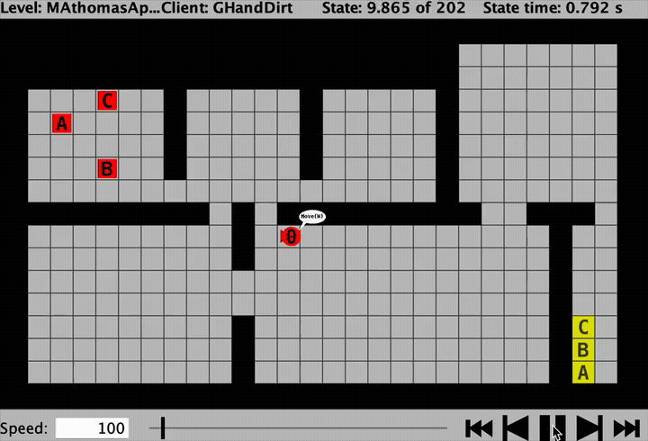
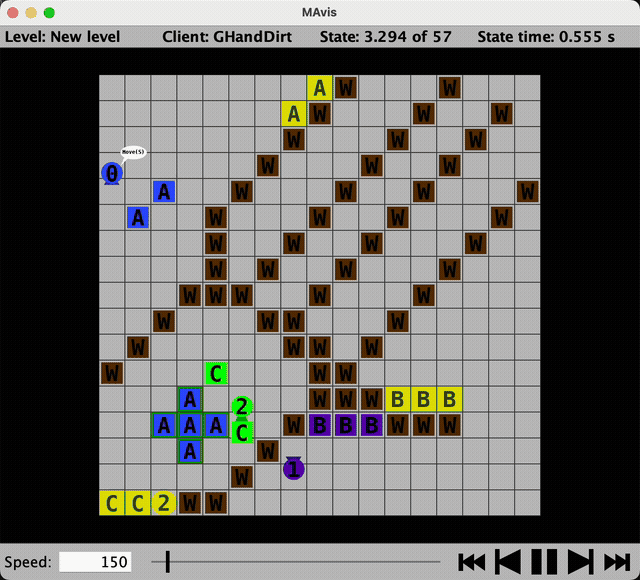
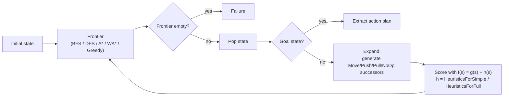
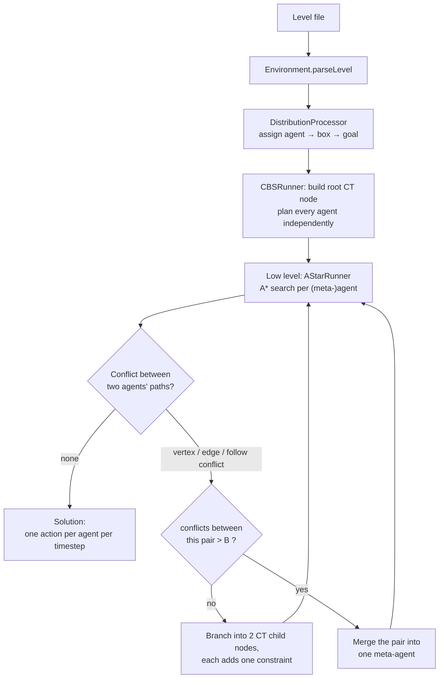
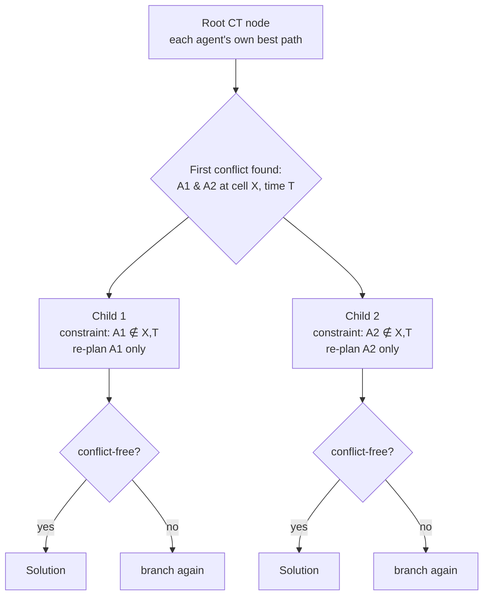

# DTU 02285 — Multi-Agent Pathfinding Search Client

A Java search client for the DTU course **02285 Artificial Intelligence and Multi-Agent Systems**. Agents move around a grid warehouse, pushing colored boxes onto matching goal cells, while a server (`server.jar`, supplied by the course, not included in this repo) simulates the world and validates the client's actions.

The repo contains two clients:

- **`SearchClient`** — classic single-agent search (BFS, DFS, A*, Weighted A*, Greedy) for single-agent levels.
- **`NewSearchClient`** — a **Conflict-Based Search (CBS) / Meta-Agent CBS (MA-CBS)** client that plans collision-free paths for many agents at once.

## Demo

The CBS/MA-CBS client solving multi-agent levels with the server's `-g` graphical viewer:



([mp4 version](assets/demo.mp4) with slightly sharper quality, if you'd rather download it.)

**`cbslevel/GHandDirt.lvl`** — 3 colored agents navigating a diagonal-wall maze, solved with MA-CBS(25) in 0.57s / 57 actions:



([mp4 version](assets/demo-ghanddirt.mp4))

## Problem

The server defines a level as a grid of walls, agents, boxes and goal cells:

- Every agent and box has a **color**; an agent may only `Move`, `Push` or `Pull` boxes of its own color (or `NoOp`).
- Every goal cell requires either a specific box letter or a specific agent to end up on it.
- A level can contain **multiple agents** and **multiple boxes sharing the same letter/color**, so the client first has to work out *which* agent should move *which* box to *which* goal before any path planning happens.
- The client must return, for every time step, one legal action per agent (`NoOp`/`Move`/`Push`/`Pull` + direction) such that no two agents/boxes collide — i.e. it must solve both the **search** problem (find a sequence of actions reaching the goal state) and the **coordination** problem (make sure concurrent agents don't run into each other).

This repo tackles that in two stages: a single-agent solver used to plan one (meta-)agent's path in isolation, and a multi-agent layer on top that detects and resolves conflicts between agents' individually-optimal plans.

## Algorithms

**Single-agent search (`SearchClient`, `GraphSearch`, `Frontier`, `Heuristic`)**

- Implements the generic Graph-Search algorithm (AIMA fig. 3.7): pop a state from the frontier, expand it if not already visited, repeat until a goal state or an empty frontier.
- The search *strategy* is pluggable via the `Frontier` interface: `FrontierBFS`, `FrontierDFS`, and `FrontierBestFirst` (priority-queue based, used for A*, Weighted A*, and Greedy — they differ only in the `Heuristic`'s `f(state)` evaluation function).
- Heuristics (`HeuristicsForSimple`): count of misplaced goals, and total Manhattan distance from each box/agent to its goal.
- A more informed heuristic (`HeuristicsForFull`): groups agents and boxes by color, computes the cost to solve each color-group independently, and takes the **max** across groups (since independent groups can act in parallel) instead of summing every box/agent distance.



**Multi-agent search — Conflict-Based Search / MA-CBS (`NewSearchClient`, `searchclient.cbs.*`)**

CBS is a two-level algorithm for optimal multi-agent pathfinding:

- **Low level** (`AStarRunner` / `AStarFrontier`): plans a path for a single (meta-)agent with A*, subject to a set of *constraints* (this agent may not be at cell X at time T).
- **High level** (`CBSRunner`): starts from the root node (every agent's unconstrained best path), and repeatedly:
  1. Detects the first conflict between two agents' paths — vertex, edge or "follow" conflicts (`MinTimeConflictDetection`, `VertexConflict`/`EdgeConflict`/`FollowConflict`).
  2. If no conflict exists, the current node's paths are the solution.
  3. Otherwise it branches into two child nodes, each adding a constraint that forbids one of the two agents from the conflicting move, and re-plans just that agent's low-level path.
  4. Explores the resulting constraint tree in cost order (`OpenList`) until a conflict-free node is found.
- **MA-CBS extension**: when two (meta-)agents accumulate more conflicts than a threshold `B` (the CLI argument to `NewSearchClient`), they are merged into a single meta-agent and re-planned jointly instead of being constrained forever — this trades a larger low-level search space for fewer/no high-level conflicts. `B = -1`/absent means plain CBS (no merging); `B = 0` merges eagerly.
- **Task assignment** (`DistributionProcessor`, originally in `CBSRunner`): before any of the above runs, decides which agent is responsible for which box and which goal, since a level can have several same-letter boxes and several agents of the same color that could plausibly move any of them.



The high-level search explores the resulting constraint tree in cost order, expanding the cheapest still-conflicting node first:



Benchmark comparisons between plain A* and MA-CBS at different `B` thresholds are recorded in [`cbslevel/result_analysis.md`](cbslevel/result_analysis.md). Known open problems (agent/box task grouping, sub-task end states blocking other agents, inter-blocking corridors) are tracked in [`cbslevel/AA-Issue.md`](cbslevel/AA-Issue.md) and [`cbslevel/20250424-New-Issue.md`](cbslevel/20250424-New-Issue.md).

## Repository layout

```
searchclient/
  SearchClient.java, Frontier.java, GraphSearch.java, Heuristic*.java, ...   # classic search algorithms
  NewSearchClient.java                                                      # CBS / MA-CBS entry point
  cbs/
    algriothem/   # AStarRunner/AStarFrontier (low-level single-agent solver),
                   # CBSRunner (high-level conflict tree), DistributionProcessor
                   # (agent↔box task assignment), MinTimeConflictDetection
    model/        # Environment, Agent, Box, Node, Solution, Constraint,
                   # Vertex/Edge/Follow conflicts, ...
    utils/        # reachability checks, level-to-model conversion

cbslevel/          # multi-agent test levels (.lvl) + design notes on open problems
readme-searchclient.txt   # original course instructions for SearchClient
readme-cbs-client.txt     # instructions for the CBS client
```

## Local setup

`server.jar` is provided by the course and is **not** included in this repo — get it from the course materials (e.g. the `programming-project` handout on DTU Learn), then point `SERVER_JAR` at it:

```bash
export SERVER_JAR=/path/to/server.jar
```

## Building

Run from the **repo root** (the `searchclient` package folder lives directly under it, so the repo root is the javac source root):

```bash
javac -d out $(find searchclient -name "*.java")
```

This compiles both `SearchClient` and `NewSearchClient` (and everything under `searchclient/cbs/`) into `out/`. Requires JDK 11+. Make sure the `CLASSPATH` environment variable is **not** set, or compilation may fail.

## Running

All commands below run from the **repo root**, using the classes just built in `out/`.

**Classic single-agent search** (needs a course-provided single-agent level, e.g. from the `levels/` folder that ships alongside `server.jar`):

```bash
java -jar "$SERVER_JAR" -l /path/to/levels/SAD1.lvl -c "java -cp out searchclient.SearchClient -astar" -g -s 150 -t 180
```

Swap `-astar` for `-dfs`, `-wastar`, or `-greedy` (default is BFS).

**CBS / MA-CBS client, on this repo's own multi-agent levels** (`cbslevel/`):

```bash
# Basic CBS, no merging
java -jar "$SERVER_JAR" -l cbslevel/MAsimple1.lvl -c "java -cp out searchclient.NewSearchClient" -g -s 150 -t 180

# MA-CBS: merge two agents into a meta-agent after 25 conflicts between them
java -jar "$SERVER_JAR" -l cbslevel/MAsimple2.lvl -c "java -cp out searchclient.NewSearchClient 25" -g -s 150 -t 180
```

`-g` opens the graphical viewer so you can watch the agents move — that's what [the demo above](#demo) was recorded from. Drop it to run headless. Other levels worth trying for multi-agent effects: `cbslevel/MAsimple3.lvl`, `MAsimple4.lvl`, `Flower.lvl`, `JAMP.lvl`, `YummAI.lvl`.

Give the JVM at least 4GB of heap on larger levels: `java -jar "$SERVER_JAR" -l ... -c "java -Xmx4g -cp out searchclient.NewSearchClient 25" ...`.

## Team

Developed as a group project; see `git shortlog -sn` for full commit history across contributors.
